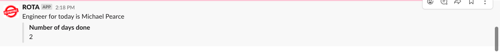
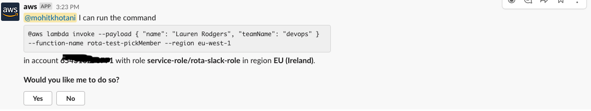

# Rota

## Description

Lists the order in which people will take turns. This project will give all the team members equal 
responsibility to do a particular job. It can be giving demonstration on sprint retro, taking
stand up actions, etc. A member will be picked daily so that it is more optimal and less biased
than picking members weekly. Currently we use some random spinner, which is not very accurate in 
picking up the members. This project takes care of people who are on leave by calling Bamboo Apis 
and making them unavailable for that day, and then next person is given the turn. There is a lambda
function `pickMember` which gets triggered by a cloudwatch event rule, the cron for that lambda is
configured to run at a set time from monday to friday. The output from that lambda function is
shown on the slack channel. The output on the slack channel looks something like this.

This project also provides the functionality to mark a person unavailable for the day. There might be
several reasons to this for example that person is busy doing some other stuff or off sick. Marking a person unavailable for the day is simple it is just invoking the lambda function from the slack 
channel. AWS chatbot service is used to integrate slack channel with the lambda, so that lambda 
function can be invoked from the slack channel only. Lambda invocation from the slack channel look 
like this.

## Running the service
1. Deploy the clouformation stack `resources.yml`, it creates the dynamoDB table.
2. Deploy serverless project, it deploys the lambda and the cloudwatch event rule.
3. Slack Webhook should be created so that updates are posted on slack channel.
4. Configure AWS chatbot to invoke lambda function from the slack channel.
5. Store the bamboo secret in secrets manager.
6. Now the script would run according to the cron specified in the serverless project.

## Gotchas
1. This project does not take care the account of flexible holidays as they are not recorded in 
Bamboo so if a person is absent, he shall be marked unavailable through slack channel only.
2. Some national holidays are also not stored in bamboo so people picked on that day would have the extra credit.
3. [individual auth tokens only](https://documentation.bamboohr.com/docs#section-authentication) - BambooHR doesn't allow you to create system users to use a set api key, it must be authenticated and permissioned as if it were a real user of the software.

## References 
1. [Information about using the BambooHR API](https://documentation.bamboohr.com/reference)
2. [Javascript SDK]()
3. [AWS Chatbot](https://aws.amazon.com/blogs/devops/running-aws-commands-from-slack-using-aws-chatbot/)
